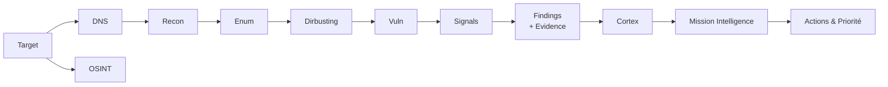

<h1 align="center">RedOps3</h1>

<p align="center">
  <b>Offensive Exploration Orchestrator</b><br>
  Découvrir, comprendre, prioriser. Pas juste “scanner”.
</p>

<p align="center">
  <a href="https://github.com/hda-offsec/redops3/stargazers">
    
  </a>
  <a href="https://github.com/hda-offsec/redops3/forks">
    
  </a>
  <a href="https://github.com/hda-offsec/redops3/issues">
    
  </a>
  <a href="https://deepwiki.com/hda-offsec/redops3">
    
  </a>
</p>

---

## Pitch

RedOps3, c’est une plateforme d’exploration offensive “chef d’orchestre” :

- Phase 1 : **Découvrir** ce qui existe
- Phase 2 : **Comprendre** ce qui est exposé
- Phase 3 : **Repérer** ce qui est vraiment dangereux
- Phase 4 : **Organiser** les résultats
- Phase 5 : **Relier** les indices
- Phase 6 : **Prioriser** les actions

> Usage éthique only : à utiliser uniquement sur des cibles pour lesquelles tu as une autorisation.

---

## Pipeline visuel



---

## Ce que tu viens chercher ici

### 1) DNS (Surface)
- subdomains
- records

### 2) Recon (Ouvertures)
- ports
- services
- screenshots / matrice

### 3) OSINT (Contexte externe)
- cloud assets
- emails
- dorks
- origin IPs
- GitHub leaks
- historic URLs

### 4) Enum (Structure technique)
- whatweb / tech footprint
- WAF
- security headers
- katana (crawl)
- arjun / params
- API discovery (et arbre)
- JS intelligence (endpoints, secrets, dérivés)

### 5) Dirbusting (Fuzz)
- ffuf / endpoints “non reliés”

### 6) Vuln (Suspicion offensive)
Classes de vulnérabilités large (TLS, GraphQL, SSRF, XSS, LFI/SSTI/XXE, NoSQL, etc.), plus logique métier et expositions infra.

---

## Cortex & Mission Intelligence (l’angle “produit”)

### Cortex
- Recommandations
- Expansion de surface
- Intelligence de services
- Mining avancé (JS / dérivés)

### Mission intelligence
- Corrélation findings/signals
- Objective paths
- Actions opérateur structurées
- Qualité / rejouabilité / preuves

---

## Feature map (résumé court)

| Phase | Focus | Output |
|------|-------|--------|
| dns  | noms | surface |
| recon | ports/services | matrice |
| osint | info publique | signaux |
| enum | tech/API/params | endpoints |
| dirbusting | chemins cachés | ffuf |
| vuln | faiblesses | findings |
| cortex | analyse | recommandations |
| mission | orchestration | actions |

---

## Quickstart (minimal)
```bash
git clone https://github.com/hda-offsec/redops3.git
cd redops3
./start_redops.sh
```

---

## Roadmap (simple)
- Banner / screenshots
- Doc module par module (ui/web/templates/scan_partials/components)
- Contribution guide

---

<p align="center">
  <b>RedOps3</b> — “Découvrir, comprendre, prioriser.”
</p>
